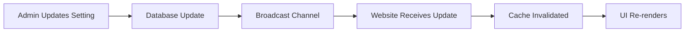

# 🌐 Website Settings Integration Guide

## What Your Website Needs to Know

### 🔴 **CRITICAL: Settings That Affect Website Functionality**

These settings MUST be synced to the website for it to function properly:

#### 1. **Store Information**
```javascript
// Website needs these for display
- store_name
- store_logo  
- contact_email
- contact_phone
- business_hours
- social_links
```

#### 2. **Payment Configuration**
```javascript
// Website needs for checkout
- stripe_public_key (NOT the secret!)
- accepted_payment_methods
- currency_code
- payment_processing_fee
```

#### 3. **Shipping Settings**
```javascript
// Website needs for cart calculation
- shipping_zones
- shipping_rates
- free_shipping_threshold
- estimated_delivery_days
```

#### 4. **Tax Configuration**
```javascript
// Website needs for pricing
- tax_rates by region
- tax_inclusive_pricing (boolean)
- applies_to_shipping (boolean)
```

#### 5. **Feature Flags**
```javascript
// Website needs to show/hide features
- guest_checkout_enabled
- wishlist_enabled
- reviews_enabled
- account_creation_required
```

---

## 📡 **How to Integrate Settings in Your Website**

### **Step 1: Install Dependencies**
```bash
npm install @supabase/supabase-js
```

### **Step 2: Create Settings Service**
```typescript
// website/src/lib/settings.ts
import { createClient } from '@supabase/supabase-js';

const supabase = createClient(
  process.env.NEXT_PUBLIC_SUPABASE_URL,
  process.env.NEXT_PUBLIC_SUPABASE_ANON_KEY
);

export class SettingsService {
  private static cache: Map<string, any> = new Map();
  private static cacheTimeout = 5 * 60 * 1000; // 5 minutes

  // Fetch public settings from Edge Function
  static async getPublicSettings() {
    const cacheKey = 'public_settings';
    
    // Check cache first
    const cached = this.cache.get(cacheKey);
    if (cached && cached.timestamp > Date.now() - this.cacheTimeout) {
      return cached.data;
    }

    try {
      // Call Edge Function
      const { data, error } = await supabase.functions.invoke('get-public-settings');
      
      if (error) throw error;
      
      // Cache the result
      this.cache.set(cacheKey, {
        data,
        timestamp: Date.now()
      });
      
      return data;
    } catch (error) {
      console.error('Failed to fetch settings:', error);
      // Return defaults if fetch fails
      return this.getDefaultSettings();
    }
  }

  // Subscribe to real-time settings changes
  static subscribeToChanges(callback: (settings: any) => void) {
    const channel = supabase
      .channel('settings-changes')
      .on('broadcast', { event: 'settings-update' }, (payload) => {
        // Clear cache on update
        this.cache.clear();
        // Notify callback
        callback(payload.payload);
      })
      .subscribe();

    return () => {
      supabase.removeChannel(channel);
    };
  }

  // Default settings fallback
  static getDefaultSettings() {
    return {
      store: {
        name: 'KCT Menswear',
        currency: 'USD',
        tax_inclusive: false
      },
      features: {
        guest_checkout: true,
        wishlist: true,
        reviews: true
      },
      shipping: {
        free_threshold: 100,
        estimated_days: '3-5'
      }
    };
  }
}
```

### **Step 3: Create Settings Context (React/Next.js)**
```typescript
// website/src/contexts/SettingsContext.tsx
import { createContext, useContext, useEffect, useState } from 'react';
import { SettingsService } from '@/lib/settings';

const SettingsContext = createContext<any>({});

export function SettingsProvider({ children }) {
  const [settings, setSettings] = useState(SettingsService.getDefaultSettings());
  const [loading, setLoading] = useState(true);

  useEffect(() => {
    // Initial load
    SettingsService.getPublicSettings()
      .then(setSettings)
      .finally(() => setLoading(false));

    // Subscribe to changes
    const unsubscribe = SettingsService.subscribeToChanges((newSettings) => {
      setSettings(newSettings);
    });

    return unsubscribe;
  }, []);

  return (
    <SettingsContext.Provider value={{ settings, loading }}>
      {children}
    </SettingsContext.Provider>
  );
}

export const useSettings = () => useContext(SettingsContext);
```

### **Step 4: Use Settings in Components**
```typescript
// website/src/components/Header.tsx
import { useSettings } from '@/contexts/SettingsContext';

export function Header() {
  const { settings } = useSettings();
  
  return (
    <header>
      
      <h1>{settings.store.name}</h1>
    </header>
  );
}

// website/src/components/Cart.tsx
export function Cart() {
  const { settings } = useSettings();
  
  const calculateShipping = (total: number) => {
    if (total >= settings.shipping.free_threshold) {
      return 0;
    }
    return settings.shipping.base_rate;
  };
  
  // ... rest of cart logic
}
```

### **Step 5: Handle Maintenance Mode**
```typescript
// website/src/middleware.ts (Next.js)
import { NextResponse } from 'next/server';

export async function middleware(request) {
  const settings = await SettingsService.getPublicSettings();
  
  if (settings.maintenance?.enabled && !request.url.includes('/maintenance')) {
    return NextResponse.redirect(new URL('/maintenance', request.url));
  }
  
  return NextResponse.next();
}
```

---

## 🔄 **Real-Time Sync Flow**



---

## ⚠️ **Important Considerations**

### **Security**
- NEVER expose secret keys (Stripe secret, SMTP passwords)
- Only fetch settings marked as `is_public = true`
- Use Edge Functions for controlled access
- Implement rate limiting on settings endpoints

### **Performance**
- Cache settings aggressively (5-10 minutes)
- Use CDN for static settings (logo, etc.)
- Bundle critical settings in initial page load
- Lazy load non-critical settings

### **Fallbacks**
- Always have default settings
- Handle network failures gracefully
- Store critical settings in environment variables as backup
- Use localStorage for offline support

---

## 📝 **Environment Variables Needed**

Add these to your website's `.env`:
```bash
NEXT_PUBLIC_SUPABASE_URL=https://gvcswimqaxvylgxbklbz.supabase.co
NEXT_PUBLIC_SUPABASE_ANON_KEY=your-anon-key
NEXT_PUBLIC_ADMIN_API_URL=https://super-admin-ruby.vercel.app
```

---

## 🧪 **Testing Integration**

1. **Test settings fetch:**
```javascript
const settings = await SettingsService.getPublicSettings();
console.log('Settings loaded:', settings);
```

2. **Test real-time updates:**
```javascript
// In admin panel, change a setting
// Website should receive update within 1-2 seconds
```

3. **Test fallbacks:**
```javascript
// Disconnect network
// Website should use default settings
```

---

## 🚀 **Quick Start**

1. Copy the SettingsService to your website
2. Add the SettingsContext provider
3. Wrap your app with the provider
4. Use `useSettings()` hook in components
5. Test with admin panel changes

The system is designed to be resilient, performant, and secure!